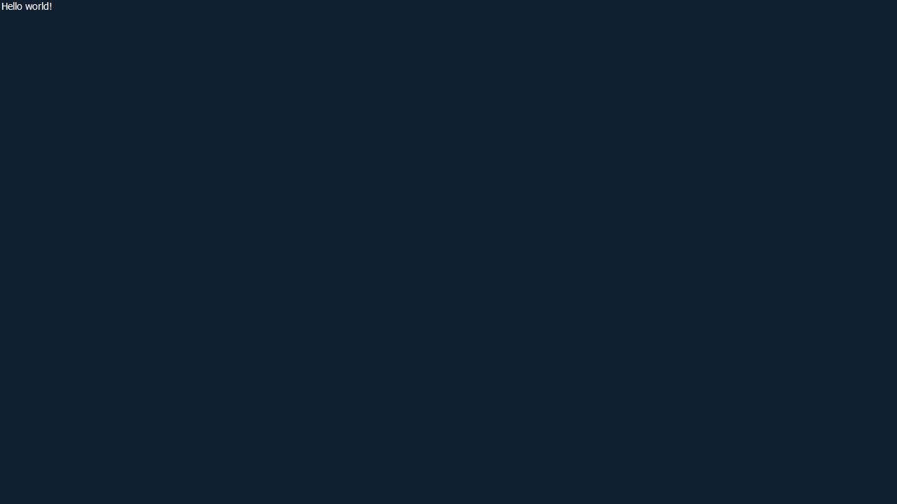

# **Awincs** - Graphics Win32 Controls Library

> The actronym Awincs stands for ***Awesome Windows Controls***.

- **Supported platforms**: Windows 10 x86/x64
- **Verions**: 0.0.2

### Dependencies to include:

- Default windows libraries:
    - gdiplus.lib `*`
    - dwmapi.lib `*`
    - uxtheme.lib `*`
- Third-party:
    - [maxnevans/DebugConsole](https://github.com/maxnevans/DebugConsole)

> Remark: If you are going to include source code into your project than you will need all dependencies from list above. But if you are going to include just `.lib` in you project than you will need to include only marked with `*` dependencies.

### Overview:

Create modern UI applications with Awincs. It's very simple to create hello world application:
```c++
/* This is your main.cpp */

#pragma comment(lib, "gdiplus.lib")
#pragma comment(lib, "uxtheme.lib")
#pragma comment(lib, "dwmapi.lib")

// <this-repo>/include/Awincs.h
#include "Awincs.h"

/* Awincs entry point */
Awincs::AppRetType Awincs::App(std::vector<std::wstring> args)
{
    auto wnd = std::make_shared<WindowController>(
        WindowController::Point{100, 100}, 
        WindowController::Dimensions{1280, 720});

    auto panel = std::make_shared<PanelComponent>();
    panel->setDimensions({ 1280, 720 });
    panel->setText(L"Hello world!");
    panel->showText();
    panel->setTextColor(makeARGB(170, 180, 90), ComponentState::DEFAULT);
    panel->setParent(wnd);

    wnd->show();
    wnd->redraw();

    return {wnd};
}
```

And this is the result you will get at after build and run this application:




#### This will be updated later!